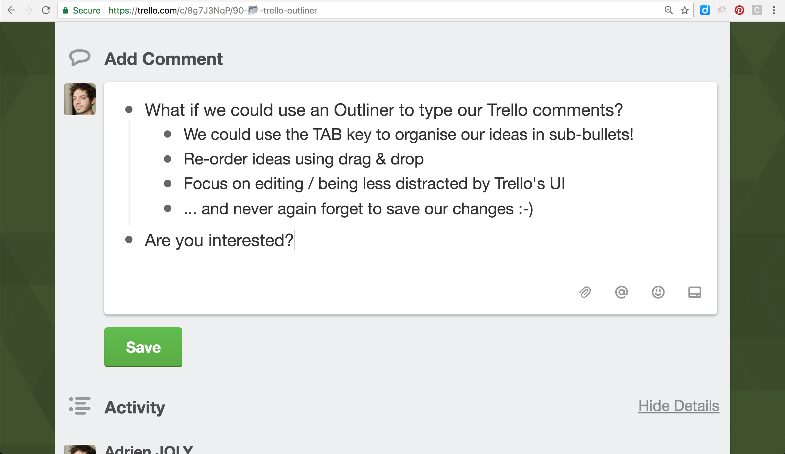

# Trello Outliner

A Trello Power-Up that allows you to edit card comments using an Outliner.

▶ [Home page](https://adrienjoly.com/trello-outliner) (*`gh-pages` branch of the repo*)

▶ [More details](docs/codegeist-submission.md)

▶ [Glitch](https://glitch.com/edit/#!/glitch-github-sync)

### Want to test this Power-up?

Follow these instructions:

1. Go to [https://trello.com/power-ups/admin](https://trello.com/power-ups/admin)
2. Pick the team with which you'd like to test Trello Outliner (you can create your own, with only yourself inside)
3. Click on *Create New Power-Up*
4. In the *Power-Up Name* field, type `Outliner (test)`
5. In the *Manifest URL* field, type `https://trello-outliner-github.glitch.me/manifest.json`
6. Then, press *Save*.
7. Go to one of your Trello boards that belong to the team you had picked in step 2
8. Open a card that contains at least one comment (or create one)
9. Click the *Outline* button on the right of the card, in the Power-ups section
10. Click the comment that you'd like to edit => it should open a new tab that allows you to edit that comment (without Markdown formatting, for now)
11. In that tab, make a simple change (e.g. add some text), then press *Save*
12. Back to your Trello tab, the comment should have been updated.

If you notice any problem, please contact me at adrien.joly (@) gmail.com, and tell me what step fails, and how.
